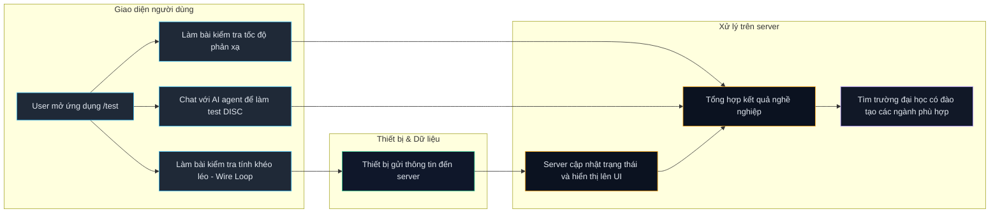

# Tay Application

## Huong dan cai dat va chay

## Cach clone repo

```bash
git clone https://github.com/juStD-34/HHA_STEAM.git
```

Su dung cac file trong thu muc `Huong dan`:

### Cai dat
- macOS: `Huong dan/cai_dat_mac.sh`
- Windows: `Huong dan/cai_dat_win.bat`

### Chay ung dung
- macOS: `Huong dan/chay_mac.sh`
- Windows: `Huong dan/chay_win.bat`

---

## Work-flow (Mermaid)


